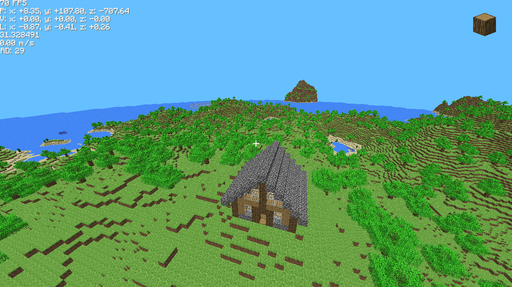
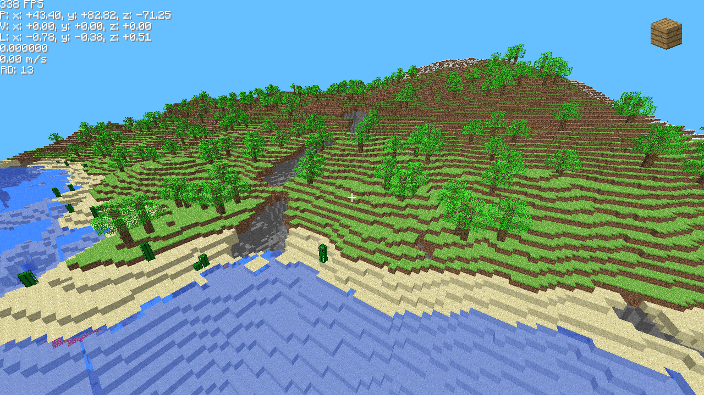
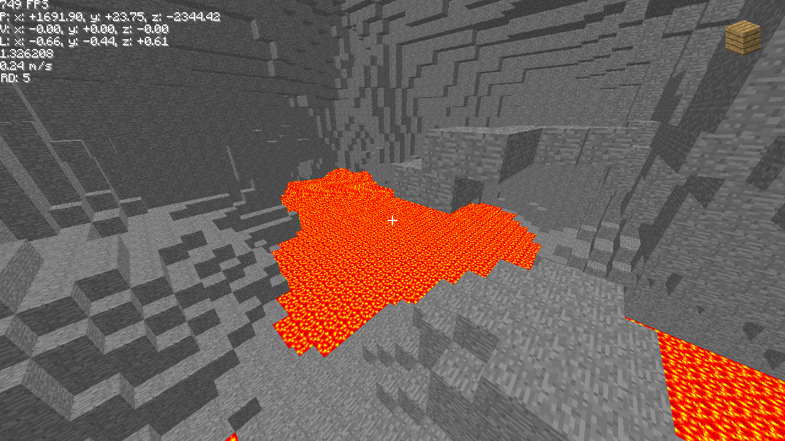
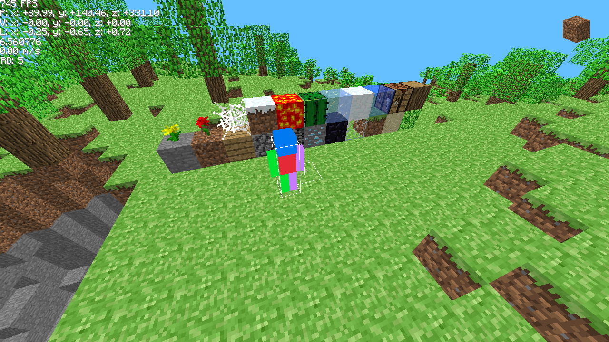

# Fakecraft
A voxel sandbox game based on Minecraft, written in C++ using OpenGL. Previously it was written in C99 using
Raylib and it is currently in the process of being ported to C++ so the code structure is still more similar
to C than C++ in many places.

## Dependencies

Fakecraft depends on
1. GLFW3
2. GLM
3. [stb_perlin](https://github.com/nothings/stb/blob/master/stb_perlin.h) for perlin noise
   (used in terrain generation)
   and stb_image for loading images.
   These are already included in the project as single header files in `external/`

## Building
The git repository does not contain any copyrighted material. To make the game playable you'll first need to get some textures.
1. Create a directory `resources/` in the repositories root directory
2. Add a spritefont as `resources/defaultSpritefont.png`. You can find some online, the size might be a bit off
3. Add a file called `resources/alphaTerrain.png` this should be in the format of Minecrafts `terrain.png`.
   Any version of `terrain.png` should work but I suggest using the file from version Alpha v1.0.14. You can extract it from
   a legitimate copy of the game or download it [here](https://minecraft.wiki/w/File:201007301722_terrain.png)
4. Run `make`

## Controls

Movement: WASD

Sprint: Left Shift

Break Block: Left Click

Place Block: Right Click

Pick Block: Middle Click

Cycle Through Blocks: Scroll Wheel

Toggle Fly: F

Toggle NoClip: N

Spawn Entity: H

Decrease Render Distance: F8

Increase Render Distance: F9

Toggle Fullscreen: F11

Close Game: ESC

## Images

